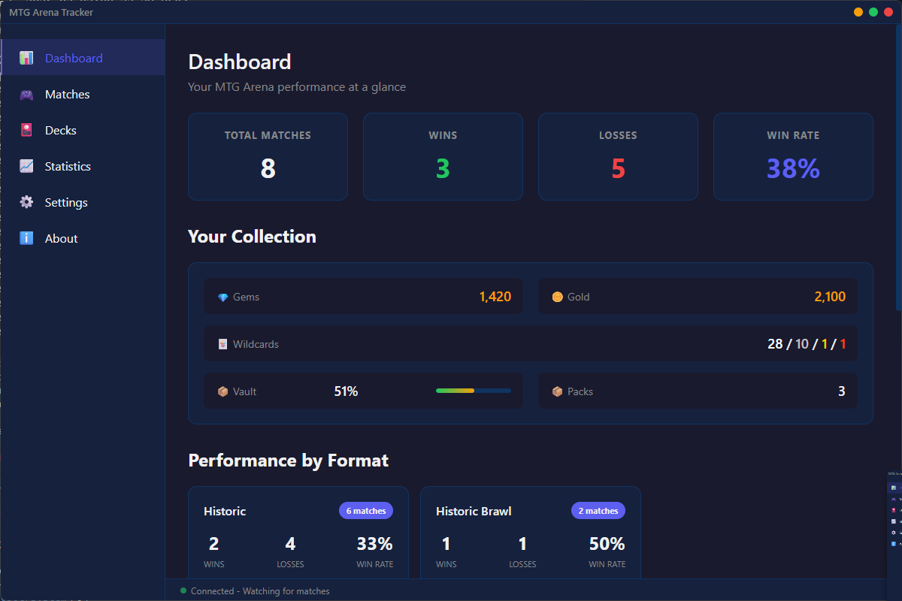
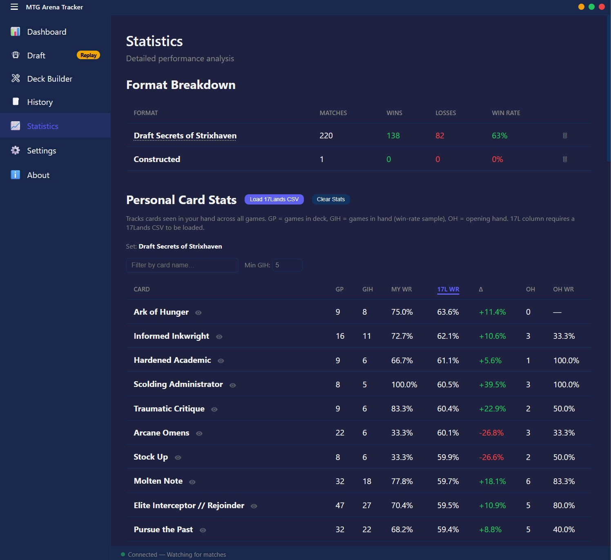
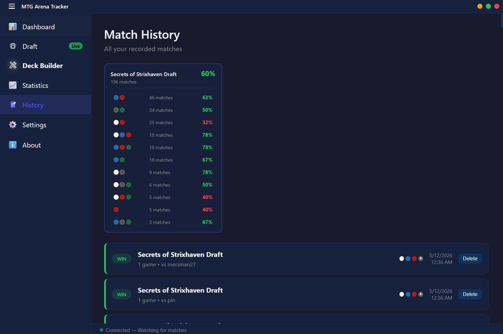

# MTG Arena Tracker

A **standalone** MTG Arena deck tracker that automatically reads your game logs

## Features

### Dashboard
At-a-glance view of your match summary, inventory (gems, gold, wildcards, packs), and recent matches.



### Draft Assistant
Live pack ratings for your current draft pick, powered by your 17Lands CSV data.


### Deck Builder
Analyze your draft card pool by color and calculate the odds of drawing any card in your opening hand.


### Statistics Tracking
Card-level win-rate stats across your entire match history.



### History by Format
Browse and filter all your past matches organized by format and deck.



## How It Works

This tracker reads MTG Arena's log file (`Player.log`) in real-time and extracts:
- Match start/end events
- Game results (win/loss/draw) with proper team detection
- Deck information and card lists
- Format played
- Player inventory (gems, gold, wildcards, packs)

## System Requirements

- **Windows 10 or Windows 11** (64-bit)
- No other software required for the installer

## Installation

### Option 1 — Installer (Recommended)

1. Go to the [Releases](../../releases) page
2. Under the latest release, download **`MTG Arena Tracker Setup x.x.x.exe`**
3. Run the installer — Windows may show a SmartScreen warning since the app isn't code-signed; click **More info → Run anyway**
4. Launch **MTG Arena Tracker** from your desktop shortcut or Start menu

No Node.js, Python, or any other software required.

### Option 2 — Run from Source

1. Install **Node.js** (v16 or higher)
2. Clone or download this repository
3. Run the following:

```bash
cd MTG-Arena-Tracker
npm install
npm start
```

## Prerequisites

Before using the tracker:

1. **Enable Detailed Logs** in MTG Arena:
   - Open MTG Arena
   - Go to **Settings** → **Account**
   - Check **"Detailed Logs (Plugin Support)"**
   - **Restart MTG Arena** (important!)

## Usage

1. **Start the tracker** — Launch the installed app or run `npm start`
2. **Launch MTG Arena** — Make sure detailed logs are enabled
3. **Play a match** — The tracker will automatically detect it
4. **Check your stats** — Open the tracker window to see your performance

The tracker runs in your system tray and will notify you when matches complete.

### First Run

On first launch, the tracker will:
1. Download the card database from Scryfall (~16,000 Arena cards)
2. Start watching your MTG Arena log file
3. Show the dashboard with your stats

## Log File Location

The tracker automatically looks for the log file at:
```
%USERPROFILE%\AppData\LocalLow\Wizards Of The Coast\MTGA\Player.log
```

If your game is installed elsewhere, you can configure the path in **Settings**.

## Dashboard

The main dashboard shows:
- **Match Summary** - Total matches, wins, losses, win rate
- **Your Collection** - Gems, gold, wildcards, vault progress, packs
- **Performance by Format** - Win rates for each format
- **Recent Matches** - Last 10 matches with deck and result

## Draft Assistant

The Draft Assistant shows live pack ratings for your current draft pick, powered by 17Lands win-rate data. To use it:

1. Go to **Settings** → **Draft Assistant** and load your 17Lands CSV file (download from [17lands.com/card-ratings](https://www.17lands.com/card-ratings))
2. Start a draft in MTG Arena — the tracker detects picks automatically
3. Open the **Draft** tab to see ratings for the current pack

After your draft is complete, the **Deck Builder** tab highlights automatically to prompt you to analyze your card pool.

## Deck Builder

The Deck Builder helps you build your post-draft deck:

- **Color Pool** — See all cards you drafted broken down by color, sortable and searchable
- **Hypergeometric Calculator** — Calculate the probability of drawing a specific card or land count in your opening hand

## Troubleshooting

### Not detecting matches?

**First, check the status bar:**
- Green pulsing = Connected and watching
- Yellow = Match in progress
- Red = Error or disconnected

**Run the debug check:**
```bash
node debug.js
```

Or go to **Settings** → **Scan Now** to manually refresh.

### Common Issues

#### 1. **No log file found**
```
❌ Log file not found at: ...
```
**Fix:**
- Make sure MTG Arena is installed
- The log file is created only after you launch the game with detailed logs enabled

#### 2. **Detailed logs not enabled**
```
⚠️  No events detected
```
**Fix:**
1. Open MTG Arena
2. Go to **Settings** → **Account**
3. Check **"Detailed Logs (Plugin Support)"**
4. **Restart MTG Arena completely**
5. Play at least one match

#### 3. **Card names not showing**
Go to **Settings** → **Card Database** → **Update Now** to download the latest card database.

#### 4. **Pack count doesn't match**
The log only updates inventory when MTG Arena starts. If you earned packs during gameplay, restart MTG Arena to refresh the count.

#### 5. **Log file cleared**
Note: MTG Arena **clears** the log file when the game starts. You must:
1. Start the tracker **after** MTG Arena has launched
2. Keep the tracker running **during** matches
3. The tracker only sees matches played while it's running

### Debug Mode

To see what the parser is doing in real-time:

1. Open the tracker
2. Go to **Settings**
3. Click **"Scan Now"** button
4. Check the console output

You should see messages like:
```
[AutoScan] Parsed 5 events from full log
[AutoScan] Found match: xx-xx-xx - Result: win
[Inventory] Updated: 1420 gems, 4350 gold
```

### Still not working?

1. Make sure you ran `npm install` in the tracker folder (source installs only)
2. Try running the tracker from command line to see errors:
   ```bash
   npm start
   ```
3. Check if your antivirus is blocking file access
4. Try running the tracker as Administrator

## Data Storage

Your match data is stored locally in:
- **Windows**: `%APPDATA%\MTG Arena Tracker\data\`

The card database is stored in the same `%APPDATA%\MTG Arena Tracker\` folder.

You can back up or restore your data from the **Settings** page using the Import/Export options. To restore from a backup, click **Import** and select the folder containing your data files.

## Technologies Used

- **Electron** - Desktop app framework
- **electron-builder** - Packages the app into a standalone installer
- **Chokidar** - File watching for real-time log parsing
- **Scryfall API** - Card database (bulk data)
- **17Lands** - Draft card ratings (user-supplied CSV)
- **Node.js** - Backend runtime

## App Structure

```
MTG-Arena-Tracker/
├── main.js                      # Electron main process, file watcher
├── logParserV5.js               # Parses MTG Arena log files
├── dataStore.js                 # Manages match data storage
├── cardUpdater.js               # Downloads card database from Scryfall
├── setEnricher.js               # Supplements card DB with MTGA set data
├── draftAssistant.js            # Draft pick rating engine (17Lands)
├── draftPipeline.js             # Coordinates draft event processing
├── eventCoalescer.js            # Deduplicates/coalesces log events
├── sets.js                      # Set metadata and format helpers
├── parser/
│   └── greParser.js             # Parses GRE (game engine) protocol events
├── renderer.js                  # UI coordinator (thin)
├── renderer/                    # UI modules
│   ├── state.js                 # Shared mutable state
│   ├── shared.js                # Pure utility functions
│   ├── cardPreview.js           # Scryfall hover preview
│   ├── dashboard.js             # Dashboard panel
│   ├── matchHistory.js          # Match history panel
│   ├── stats.js                 # Card stats panel
│   ├── draftAssistant.js        # Draft assistant panel
│   ├── settings.js              # Settings panel
│   └── deckBuilder/
│       ├── index.js             # Deck builder panel coordinator
│       ├── colorPool.js         # Draft card pool by color
│       └── hypgeoCalculator.js  # Hypergeometric probability math + UI
├── styles/                      # CSS by feature
│   ├── base.css
│   ├── layout.css
│   ├── dashboard.css
│   ├── matchHistory.css
│   ├── stats.css
│   ├── draft.css
│   ├── deckBuilder.css
│   └── settings.css
├── index.html                   # App shell
├── package.json                 # Dependencies and build config
└── README.md
```

## How It Compares to Other Trackers

| Feature | MTG Arena Tracker | Other Trackers |
|---------|-------------------|----------------|
| In-game overlay | ❌ No | ✅ Yes |
| System resource usage | ✅ Low | ⚠️ Higher |
| No third-party accounts | ✅ Yes | ❌ Account required |
| Auto-tracking | ✅ Yes | ✅ Yes |
| Privacy | ✅ Local only | ☁️ Cloud synced |
| Card database | ✅ Auto-updating | Varies |
| Standalone installer | ✅ Yes | Varies |
| Free | ✅ Yes | ✅/💰 Varies |

This tracker is perfect if you want:
- A lightweight alternative to others
- Privacy (data stays on your machine)
- No account creation required
- Just the stats, no bloat

## Limitations

- No in-game overlay (by design - runs separately)
- Requires manual viewing of stats (not while playing)
- Inventory updates only when MTG Arena starts (game limitation)
- Some very new cards may not be in the database yet

## Building from Source

To produce a standalone Windows installer yourself:

```bash
npm install
npm run dist
```

The installer will be output to `dist/MTG Arena Tracker Setup x.x.x.exe`.

## Contributing

This is an open source project. It is developed and maintained by gronaldo44 and KMorrison. That said, you are absolutely free to fork it and use it as the basis for your own work. My discord is gronaldo44.

Pull requests are also welcome. If you have a bug fix or improvement that fits the project's direction, feel free to open one. There are no guarantees of merge or timeline, but good contributions will be considered.

Please open an issue before submitting a large PR so we can discuss whether it's a good fit.

## Sources

- **[Shalkith/MTG-Arena-Tracker](https://github.com/Shalkith/MTG-Arena-Tracker)** — Original project this was forked from
- **[Scryfall](https://scryfall.com/)** — Card database API (bulk data download)
- **[17Lands](https://17lands.com/)** — Draft card ratings and win-rate data (user-supplied CSV from 17lands.com/card-ratings)
- [MTG Arena Tool](https://mtgatool.com/) — Log parsing approach reference
- [rconroy293/mtga-log-client](https://github.com/rconroy293/mtga-log-client) — 17Lands client reference

## License

MIT — Free to use, modify, and distribute.
