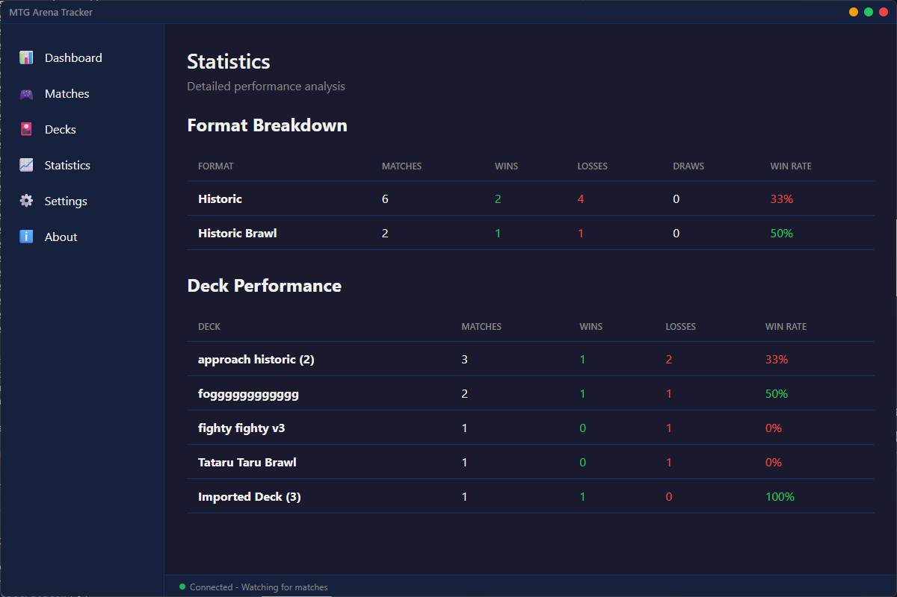
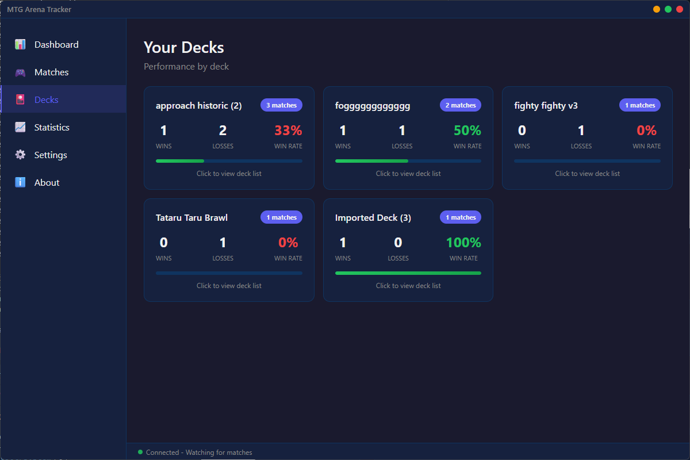

# MTG Arena Tracker

A **standalone** MTG Arena deck tracker that automatically reads your game logs

## Features



- **Automatic Match Tracking** - Detects matches as you play in real-time
- **Format Grouping** - Tracks stats for Standard, Alchemy, Historic, Explorer, Pioneer, Timeless, Brawl, and more
- **Deck Detection** - Automatically identifies your decks with full card lists
- **Win/Loss Tracking** - Accurate match results based on game state
- **Card Database** - Auto-updating database from Scryfall with 16,000+ Arena cards
- **Draft Assistant** - Live pack ratings powered by 17Lands CSV data
- **Inventory Tracking** - Shows gems, gold, vault progress, wildcards, and packs
- **Real-time Status** - Status bar updates with match progress and results
- **System Tray** - Runs in the background with tray notifications
- **Data Export/Import** - Backup and restore your match history
- **No Account Required** - All data stays local on your machine

## How It Works

This tracker reads MTG Arena's log file (`Player.log`) in real-time and extracts:
- Match start/end events
- Game results (win/loss/draw) with proper team detection
- Deck information and card lists
- Format played
- Player inventory (gems, gold, wildcards, packs)

## Prerequisites

1. **Node.js** installed (v16 or higher recommended)
2. **Enable Detailed Logs** in MTG Arena:
   - Open MTG Arena
   - Go to **Settings** → **Account**
   - Check **"Detailed Logs (Plugin Support)"**
   - **Restart MTG Arena** (important!)

## Installation

```bash
# Clone or download this repository
cd MTG-Arena-Tracker

# Install dependencies
npm install

# Run the tracker
npm start
```

## Usage

1. **Start the tracker** - Run `npm start`
2. **Launch MTG Arena** - Make sure detailed logs are enabled
3. **Play a match** - The tracker will automatically detect it
4. **Check your stats** - Open the tracker window to see your performance

The tracker runs in your system tray and will notify you when matches complete.

### First Run

On first launch, the tracker will:
1. Download the card database from Scryfall (~16,000 Arena cards)
2. Start watching your MTG Arena log file
3. Show the dashboard with your stats

## Log File Location

The tracker automatically looks for the log file at:
```
%USERPROFILE%\AppData\LocalLow\Wizards Of The Coast\MTGA\Player.log
```

If your game is installed elsewhere, you can configure the path in **Settings**.

## Dashboard


The main dashboard shows:
- **Match Summary** - Total matches, wins, losses, win rate
- **Your Collection** - Gems, gold, wildcards, vault progress, packs
- **Performance by Format** - Win rates for each format
- **Recent Matches** - Last 10 matches with deck and result

## Decks & Cards



- View all your decks and their win rates
- Click any deck to see the full card list
- Card names are resolved using the Scryfall database
- Export decks to clipboard in standard format

## Troubleshooting

### Not detecting matches?

**First, check the status bar:**
- Green pulsing = Connected and watching
- Yellow = Match in progress
- Red = Error or disconnected

**Run the debug check:**
```bash
node debug.js
```

Or go to **Settings** → **Scan Now** to manually refresh.

### Common Issues

#### 1. **No log file found**
```
❌ Log file not found at: ...
```
**Fix:**
- Make sure MTG Arena is installed
- The log file is created only after you launch the game with detailed logs enabled

#### 2. **Detailed logs not enabled**
```
⚠️  No events detected
```
**Fix:**
1. Open MTG Arena
2. Go to **Settings** → **Account**
3. Check **"Detailed Logs (Plugin Support)"**
4. **Restart MTG Arena completely**
5. Play at least one match

#### 3. **Card names not showing**
Go to **Settings** → **Card Database** → **Update Now** to download the latest card database.

#### 4. **Pack count doesn't match**
The log only updates inventory when MTG Arena starts. If you earned packs during gameplay, restart MTG Arena to refresh the count.

#### 5. **Log file cleared**
Note: MTG Arena **clears** the log file when the game starts. You must:
1. Start the tracker **after** MTG Arena has launched
2. Keep the tracker running **during** matches
3. The tracker only sees matches played while it's running

### Debug Mode

To see what the parser is doing in real-time:

1. Open the tracker
2. Go to **Settings**
3. Click **"Scan Now"** button
4. Check the console output

You should see messages like:
```
[AutoScan] Parsed 5 events from full log
[AutoScan] Found match: xx-xx-xx - Result: win
[Inventory] Updated: 1420 gems, 4350 gold
```

### Still not working?

1. Make sure you have **Node.js 16+** installed
2. Make sure you ran `npm install` in the tracker folder
3. Try running the tracker from command line to see errors:
   ```bash
   npm start
   ```
4. Check if your antivirus is blocking file access
5. Try running the tracker as Administrator (if on Windows)

## Data Storage

Your match data is stored locally in:
- **Windows**: `%APPDATA%\mtg-arena-auto-tracker\data\`

The card database is stored at: `cards.json`

You can export your data anytime from the **Settings** page.

## Technologies Used

- **Electron** - Desktop app framework
- **Chokidar** - File watching for real-time log parsing
- **Scryfall API** - Card database (bulk data)
- **17Lands** - Draft card ratings (user-supplied CSV)
- **Node.js** - Backend runtime

## App Structure

```
MTG-Arena-Tracker/
├── main.js                      # Electron main process, file watcher
├── logParserV5.js               # Parses MTG Arena log files
├── dataStore.js                 # Manages match data storage
├── cardUpdater.js               # Downloads card database from Scryfall
├── renderer.js                  # UI coordinator (thin)
├── renderer/                    # UI modules
│   ├── state.js                 # Shared mutable state
│   ├── shared.js                # Pure utility functions
│   ├── cardPreview.js           # Scryfall hover preview
│   ├── dashboard.js             # Dashboard panel
│   ├── matchHistory.js          # Match history panel
│   ├── stats.js                 # Card stats panel
│   ├── draftAssistant.js        # Draft assistant panel
│   ├── settings.js              # Settings panel
│   └── deckBuilder/
│       └── hypgeoCalculator.js  # Hypergeometric probability math + UI
├── styles/                      # CSS by feature
│   ├── base.css
│   ├── layout.css
│   ├── dashboard.css
│   ├── matchHistory.css
│   ├── stats.css
│   ├── draft.css
│   ├── deckBuilder.css
│   └── settings.css
├── index.html                   # App shell
├── cards.json                   # Card database (auto-downloaded)
├── package.json                 # Dependencies
└── README.md                    # This file
```

## How It Compares to Other Trackers

| Feature | MTG Arena Tracker | Other Trackers |
|---------|-------------------|----------------|
| In-game overlay | ❌ No | ✅ Yes |
| System resource usage | ✅ Low | ⚠️ Higher |
| No third-party accounts | ✅ Yes | ❌ Account required |
| Auto-tracking | ✅ Yes | ✅ Yes |
| Privacy | ✅ Local only | ☁️ Cloud synced |
| Card database | ✅ Auto-updating | Varies |
| Free | ✅ Yes | ✅/💰 Varies |

This tracker is perfect if you want:
- A lightweight alternative to others
- Privacy (data stays on your machine)
- No account creation required
- Just the stats, no bloat

## Limitations

- No in-game overlay (by design - runs separately)
- Requires manual viewing of stats (not while playing)
- Inventory updates only when MTG Arena starts (game limitation)
- Some very new cards may not be in the database yet

## Contributing

This is an open source project, not a community-maintained one — it is developed and maintained by the author. That said, you are absolutely free to fork it and use it as the basis for your own work.

Pull requests are also welcome. If you have a bug fix or improvement that fits the project's direction, feel free to open one. There are no guarantees of merge or timeline, but good contributions will be considered.

Please open an issue before submitting a large PR so we can discuss whether it's a good fit.

## Sources

- **[Shalkith/MTG-Arena-Tracker](https://github.com/Shalkith/MTG-Arena-Tracker)** — Original project this was forked from
- **[Scryfall](https://scryfall.com/)** — Card database API (bulk data download)
- **[17Lands](https://17lands.com/)** — Draft card ratings and win-rate data (user-supplied CSV from 17lands.com/card-ratings)
- [MTG Arena Tool](https://mtgatool.com/) — Log parsing approach reference
- [rconroy293/mtga-log-client](https://github.com/rconroy293/mtga-log-client) — 17Lands client reference

## License

MIT — Free to use, modify, and distribute.
